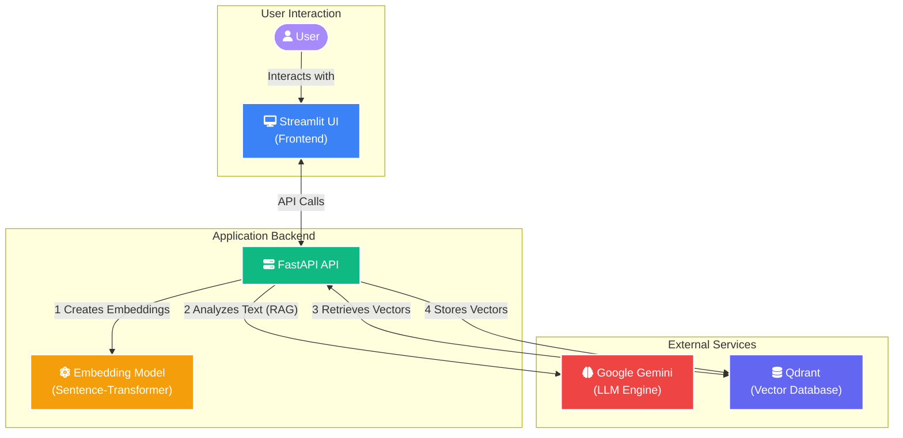

# 📄 Invoice Reimbursement RAG System

A comprehensive AI-powered invoice reimbursement analysis system built with FastAPI, LangChain, and Google Gemini LLM. This system uses RAG (Retrieval Augmented Generation) to intelligently analyze invoice documents against HR policies and provides an interactive chatbot interface for querying processed invoices.

## ✨ Key Features

- **🤖 Intelligent Invoice Analysis**: Analyze PDF invoices against HR reimbursement policies using Google Gemini LLM
- **🔍 Vector-Based Storage**: Store and retrieve invoice embeddings using Qdrant vector database
- **💬 RAG-Powered Chatbot**: Interactive chatbot for querying processed invoices using natural language
- **📦 Batch Processing**: Process multiple invoices simultaneously via ZIP file upload
- **🔄 Duplicate Detection**: Prevent duplicate processing of the same invoices
- **⚡ Streaming Responses**: Real-time streaming for both analysis and chat responses
- **🎨 Modern UI**: Clean, responsive Streamlit frontend with session management
- **🚀 RESTful API**: Comprehensive FastAPI backend with automatic documentation
- **🐳 Docker Ready**: Complete containerization with Docker Compose
- **📊 Comprehensive Logging**: Structured logging with file rotation and monitoring

## 🏗️ System Architecture



### Data Flow

1. **Upload**: Users upload HR policies and invoices (PDF/ZIP)
2. **Processing**: PDF text extraction and chunking
3. **Embedding**: Generate vector embeddings using Sentence Transformers
4. **Storage**: Store embeddings in Qdrant vector database
5. **Analysis**: Gemini LLM analyzes invoices against policies
6. **RAG**: Chatbot uses retrieval-augmented generation for queries

## 🛠️ Technology Stack

### Core Backend

- **FastAPI**: Modern, fast web framework for building APIs with automatic documentation
- **LangChain**: Framework for developing applications with LLMs
- **Google Gemini**: Advanced LLM for intelligent invoice analysis
- **Qdrant**: High-performance vector database for storing and retrieving embeddings
- **Sentence-Transformers**: Generate high-quality text embeddings (all-MiniLM-L6-v2)
- **PyPDF2**: Robust PDF text extraction and processing
- **Pydantic**: Data validation, serialization, and type safety

### Frontend & UI

- **Streamlit**: Interactive web application framework for data science
- **Streamlit-Chat**: Enhanced chat interface components for conversational UI

### Infrastructure & DevOps

- **Docker & Docker Compose**: Complete containerization and orchestration solution
- **Multi-stage Docker builds**: Optimized production-ready images
- **Health checks**: Automated service monitoring and status validation
- **Nginx** (optional): Reverse proxy and load balancing for production

### AI & Machine Learning

- **Google Generative AI**: Integration with Gemini models
- **Embedding Models**: Sentence transformers for semantic search
- **Vector Search**: Similarity search and retrieval capabilities
- **RAG Pipeline**: Retrieval-Augmented Generation for contextual responses

## � Quick Start Guide

### Prerequisites

- [Docker](https://docs.docker.com/get-docker/)  & [Docker Compose](https://docs.docker.com/compose/install/)
- At least 4GB RAM available for Docker containers
- [Google Gemini API Key](https://aistudio.google.com/app/apikey)

### Option 1: Docker Setup (Recommended) 🐳

1. **Clone and setup**:

   ```bash
   git clone https://github.com/AmanSikarwar/Reimbursement_RAG.git
   cd Reimbursement_RAG
   
   # Create environment file
   cp .env.example .env
   ```

2. **Configure your API key**:

   ```bash
   # Edit .env file and add your Gemini API key
   echo "GOOGLE_API_KEY=your_actual_api_key_here" >> .env
   ```

3. **Start everything with one command**:

   ```bash
   # Make setup script executable and run
   chmod +x docker-setup.sh
   ./docker-setup.sh setup
   ```

4. **Access your application**:

- 🎯 **Main App**: <http://localhost:8501>
- 🔧 **API Docs**: <http://localhost:8000/docs>  
- 📊 **Qdrant**: <http://localhost:6333/dashboard>

### Option 2: Local Development Setup 💻

- **Backend API**: <http://localhost:8000>
- **API Documentation**: <http://localhost:8000/docs>
- **Qdrant Dashboard**: <http://localhost:6333/dashboard>

### Docker Management Commands

The `docker-setup.sh` script provides convenient commands for managing your Docker environment:

```bash
# Initial setup (build and start everything)
./docker-setup.sh setup

# Start services in production mode
./docker-setup.sh start

# Start services in development mode (with hot reload)
./docker-setup.sh start-dev

# Stop all services
./docker-setup.sh stop

# View service status and URLs
./docker-setup.sh status

# View logs (all services)
./docker-setup.sh logs

# View logs for specific service
./docker-setup.sh logs backend
./docker-setup.sh logs frontend
./docker-setup.sh logs qdrant

# Restart services
./docker-setup.sh restart

# Clean up Docker resources
./docker-setup.sh cleanup

# Complete reset (removes volumes and rebuilds)
./docker-setup.sh reset

# Show help
./docker-setup.sh help
```

### Docker Architecture

The Docker setup includes three main services:

```text
┌─────────────────────┐    ┌─────────────────────┐    ┌─────────────────────┐
│   Streamlit UI      │    │    FastAPI API      │    │    Qdrant Vector    │
│   (Port 8501)       │◄──►│    (Port 8000)      │◄──►│    (Port 6333)      │
│   invoice-frontend  │    │   invoice-backend   │    │   invoice-qdrant    │
└─────────────────────┘    └─────────────────────┘    └─────────────────────┘
```

### Troubleshooting Docker Setup

**Services not starting:**

```bash
# Check service logs
./docker-setup.sh logs

# Check Docker system
docker system df
docker system prune -f
```

**Port conflicts:**

```bash
# Check what's using the ports
lsof -i :8000  # Backend port
lsof -i :8501  # Frontend port
lsof -i :6333  # Qdrant port
```

**Memory issues:**

```bash
# Check Docker memory usage
docker stats

# Increase Docker memory in Docker Desktop settings
# Recommended: At least 4GB RAM for Docker
```

## 💻 Local Development Setup (Alternative)

If you prefer to run without Docker, follow these steps:

## 📋 Prerequisites

- Python 3.9 or higher
- Docker (for Qdrant vector database)
- Google API Key for Gemini LLM access

## 🔧 Installation

### 1. Clone the Repository

```bash
git clone https://github.com/AmanSikarwar/Reimbursement_RAG.git
cd Reimbursement_RAG
```

### 2. Set Up Python Environment

```bash
python3 -m venv venv
source venv/bin/activate  # On Windows: venv\Scripts\activate
```

### 3. Install Dependencies

```bash
pip install -r requirements.txt
```

### 4. Set Up Environment Variables

```bash
# Copy the example environment file
cp .env.example .env

# Edit .env with your actual values
nano .env  # or use your preferred editor
```

**Required Environment Variables:**

```bash
# Gemini API Key (REQUIRED)
GOOGLE_API_KEY=your_gemini_api_key_here

# Qdrant Configuration
QDRANT_URL=http://localhost:6333
QDRANT_API_KEY=  # Leave empty for local Docker instance

# Application Settings
DEBUG=true
LOG_LEVEL=INFO
```

### 5. Start Qdrant Vector Database

```bash
# Start Qdrant using Docker
docker run -p 6333:6333 -d --name qdrant qdrant/qdrant

# Or use the VS Code task
# Command Palette > Tasks: Run Task > Start Qdrant with Docker
```

### 6. Initialize the Application

```bash
# Verify setup
python verify_setup.py

# Check configuration
python check_setup.py
```

## 🚀 Quick Start

### Option 1: Using VS Code Tasks (Recommended)

1. Open VS Code in the project directory
2. Press `Ctrl+Shift+P` (Cmd+Shift+P on Mac)
3. Select "Tasks: Run Task"
4. Choose "Build and Run Invoice Reimbursement System"

### Option 2: Manual Start

#### Start Backend (FastAPI)

```bash
# From project root
./venv/bin/python -m uvicorn app.main:app --host 0.0.0.0 --port 8000 --reload
```

#### Start Frontend (Streamlit)

```bash
# In a new terminal
./venv/bin/python -m streamlit run streamlit_app.py --server.port 8501
```

### Option 3: Using Available Tasks

```bash
# Install dependencies
python -m pip install -r requirements.txt

# Start backend
python -m uvicorn app.main:app --host 0.0.0.0 --port 8000 --reload

# Start frontend (in another terminal)
python -m streamlit run streamlit_app.py --server.port 8501
```

## 🎯 How to Use the System

### 1. Invoice Analysis Workflow

1. **Navigate** to the "📄 Invoice Analysis" page in the Streamlit interface
2. **Enter** the employee name for the reimbursement request
3. **Upload** the HR reimbursement policy document (PDF format)
4. **Upload** invoice documents:
   - Single PDF file, or
   - ZIP file containing multiple PDF invoices
5. **Click** "🔍 Start Analysis" to begin processing
6. **Review** the detailed analysis results with:
   - Approval/rejection decisions
   - Reimbursement amounts
   - Policy compliance notes
   - Detailed reasoning

### 2. Chat with Invoices

1. **Navigate** to the "💬 Chat with Invoices" page
2. **Ask questions** about your processed invoices using natural language:
   - *"Show me all declined invoices for John"*
   - *"What invoices were submitted last month?"*
   - *"List all partially reimbursed expenses"*
   - *"Why was invoice #12345 rejected?"*
3. **Get instant responses** powered by RAG technology
4. **Explore** invoice data conversationally

### 3. Advanced Features

- **Batch Processing**: Upload ZIP files with multiple invoices
- **Session Management**: Chat history is maintained per session
- **Streaming Responses**: Real-time response generation
- **Detailed Logging**: Full audit trail of all operations

## � API Reference

### Base URLs

- **Production**: `http://localhost:8000`
- **API Documentation**: `http://localhost:8000/docs` (Swagger UI)
- **Alternative Docs**: `http://localhost:8000/redoc` (ReDoc)

### Core Endpoints

#### Health & Status

| Endpoint | Method | Description | Response |
|----------|--------|-------------|----------|
| `/health` | GET | Basic health check | `{"status": "healthy"}` |
| `/api/v1/health/detailed` | GET | Detailed system status | Health details with dependencies |

#### Invoice Analysis

| Endpoint | Method | Description | Body |
|----------|--------|-------------|------|
| `/api/v1/analyze-invoices` | POST | Analyze invoices against policy | Multipart form with files |
| `/api/v1/analyze-invoices-stream` | POST | Streaming analysis responses | Multipart form with files |

#### Chatbot & RAG

| Endpoint | Method | Description | Parameters |
|----------|--------|-------------|------------|
| `/api/v1/chat` | POST | Query processed invoices | `{"message": "your question"}` |
| `/api/v1/chat/stream` | POST | Streaming chat responses | `{"message": "your question"}` |
| `/api/v1/chat/history/{session_id}` | GET | Retrieve chat history | Session ID in path |
| `/api/v1/chat/history/{session_id}` | DELETE | Clear chat history | Session ID in path |

### Request Examples

#### Analyze Invoices

```bash
curl -X POST "http://localhost:8000/api/v1/analyze-invoices" \
  -H "accept: application/json" \
  -H "Content-Type: multipart/form-data" \
  -F "employee_name=John Doe" \
  -F "policy_file=@policy.pdf" \
  -F "invoice_files=@invoices.zip"
```

#### Chat Query

```bash
curl -X POST "http://localhost:8000/api/v1/chat" \
  -H "accept: application/json" \
  -H "Content-Type: application/json" \
  -d '{"message": "Show me all rejected invoices"}'
```

## 📁 Project Structure

```text
Reimbursement_RAG/
├── app/                          # FastAPI Backend
│   ├── __init__.py
│   ├── main.py                   # FastAPI application entry point
│   ├── api/                      # API routes
│   │   └── routes/
│   │       ├── health.py         # Health check endpoints
│   │       ├── invoice_analysis.py # Invoice analysis endpoints
│   │       └── chatbot.py        # Chat endpoints
│   ├── core/                     # Core configuration
│   │   ├── config.py             # Application settings
│   │   └── logging_config.py     # Logging configuration
│   ├── models/                   # Data models
│   │   └── schemas.py            # Pydantic schemas
│   ├── services/                 # Business logic
│   │   ├── llm_service.py        # Gemini LLM integration
│   │   ├── vector_store.py       # Qdrant operations
│   │   ├── pdf_processor.py      # PDF text extraction
│   │   └── chatbot_service.py    # RAG chatbot logic
│   └── utils/                    # Utilities
│       ├── file_utils.py         # File handling utilities
│       └── responses.py          # Response utilities
├── frontend/                     # Streamlit Frontend
│   ├── streamlit_app.py          # Main Streamlit app
│   ├── pages/                    # Streamlit pages
│   │   ├── invoice_analysis.py   # Invoice analysis page
│   │   └── chat_with_invoices.py # Chat page
│   └── utils/                    # Frontend utilities
│       ├── streamlit_utils.py    # Streamlit helpers
│       └── theme.py              # UI theme configuration
├── logs/                         # Application logs
├── uploads/                      # File uploads storage
├── requirements.txt              # Python dependencies
├── .env.example                  # Environment variables template
├── streamlit_app.py              # Entry point for Streamlit
```

## ⚙️ Configuration & Environment Variables

### Required Configuration

Create a `.env` file from the template:

```bash
cp .env.example .env
```

### Environment Variables Reference

| Variable | Description | Default | Required | Example |
|----------|-------------|---------|----------|---------|
| `GOOGLE_API_KEY` | Google Gemini API key | - | ✅ | `AIzaSyC...` |
| `QDRANT_URL` | Qdrant database URL | `http://localhost:6333` | ✅ | `http://localhost:6333` |
| `QDRANT_API_KEY` | Qdrant API key (cloud only) | - | 🔄 | `your-api-key` |
| `APP_NAME` | Application name | `Invoice Reimbursement System` | ❌ | `My Invoice App` |
| `DEBUG` | Enable debug mode | `false` | ❌ | `true` |
| `LOG_LEVEL` | Logging level | `INFO` | ❌ | `DEBUG` |
| `COLLECTION_NAME` | Qdrant collection name | `invoice_reimbursements` | ❌ | `my_invoices` |
| `EMBEDDING_MODEL` | Sentence transformer model | `all-MiniLM-L6-v2` | ❌ | `all-mpnet-base-v2` |
| `MAX_FILE_SIZE` | Max upload size (MB) | `50` | ❌ | `100` |
| `LLM_MODEL` | Gemini model name | `gemini-2.5-flash` | ❌ | `gemini-1.5-pro` |
| `LLM_TEMPERATURE` | LLM creativity (0.0-1.0) | `0.1` | ❌ | `0.3` |
| `ALLOWED_HOSTS` | Comma-separated hosts | `*` | ❌ | `localhost,mydomain.com` |

### VS Code Tasks

The project includes predefined VS Code tasks for common operations:

- **Setup Python Environment**: Create virtual environment
- **Install Dependencies**: Install Python packages
- **Start Qdrant with Docker**: Launch Qdrant container
- **Run FastAPI Server**: Start backend server
- **Run Streamlit Frontend**: Start frontend application
- **Build and Run**: Complete application startup

## 📊 Logging

The application uses structured logging with:

- **File Logging**: Logs stored in `logs/` directory
- **Console Logging**: Development-friendly console output
- **Log Rotation**: Daily log file rotation
